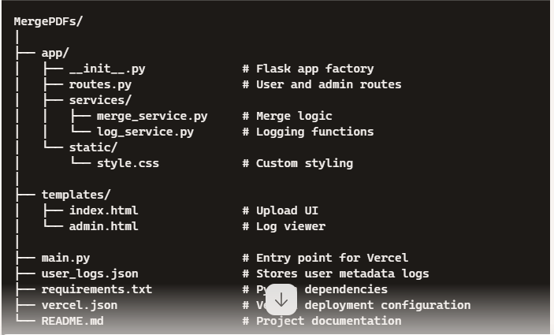

📄 MergePDFs
A secure, web-accessible tool built with Flask and pypdf, allowing users to merge multiple PDF files into a single downloadable document. Designed with modular architecture, device-aware logging, and an admin dashboard for monitoring usage across platforms.

🚀 Features
🗂 Merge multiple PDF files seamlessly

🌐 Online access via Vercel deployment

🖥️ Responsive UI accessible from mobile, desktop, and tablets

🔐 Admin dashboard to view usage logs and device metadata

📁 Modular directory structure for maintainability

🔒 Ready for JWT-based admin authentication (optional)

🧹 Auto-created temporary storage for user files

🏗️ Project Structure
MergePDFs/
│
├── app/
│   ├── __init__.py              # Flask app factory
│   ├── routes.py                # User and admin routes
│   ├── services/
│   │   ├── merge_service.py     # Merge logic
│   │   └── log_service.py       # Logging functions
│   └── static/
│       └── style.css            # Custom styling
│
├── templates/
│   ├── index.html               # Upload UI
│   └── admin.html               # Log viewer
│
├── main.py                      # Entry point for Vercel
├── user_logs.json               # Stores user metadata logs
├── requirements.txt             # Python dependencies
├── vercel.json                  # Vercel deployment configuration
└── README.md                    # Project documentation

⚙️ Installation
bash
python -m venv venv
source venv/bin/activate         # Linux / macOS
venv\Scripts\activate            # Windows

pip install -r requirements.txt
python main.py                   # Run locally
🔧 Deployment (Vercel)
Make sure you're logged into Vercel CLI, then:

bash
vercel --prod
Visit your deployed project at https://mergepdfs.vercel.app or your custom domain.

🔍 Admin Access
View logs and device metadata at:

/admin
Integrate JWT or basic auth for secure access.

📦 Dependencies
Flask==3.1.1

pypdf==5.8.0

user-agents==2.2.0

📌 Future Enhancements
🔑 JWT-based admin login

💾 MongoDB Atlas for scalable log storage

🎨 Tailwind or Bootstrap UI redesign

🚫 Abuse protection and file-size limits